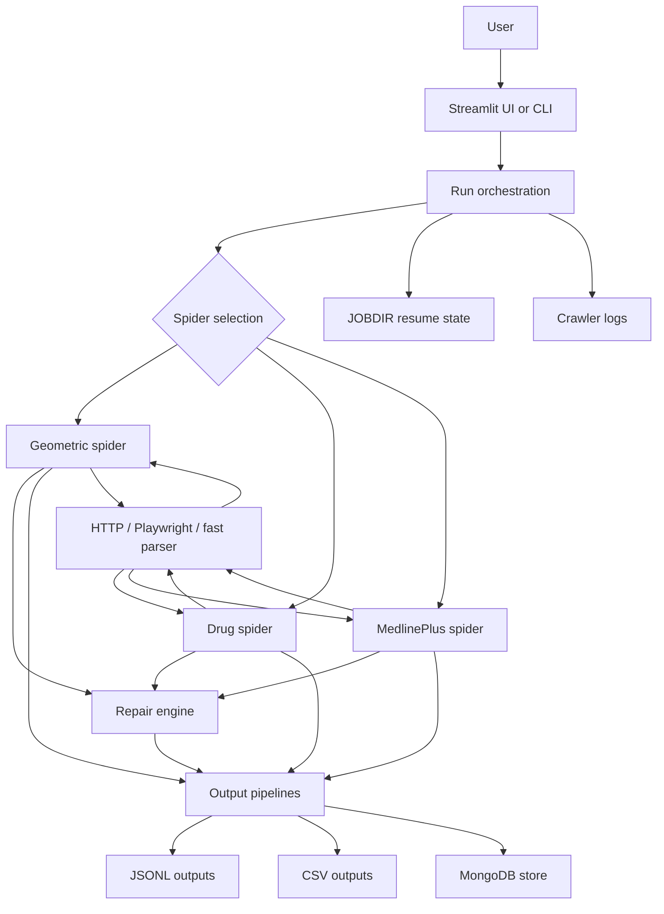

# Geometric Crawler: Development Paper

## Abstract

Geometric Crawler is a Python-based web crawling system designed for structured extraction from sites with inconsistent layouts, evolving HTML, and mixed rendering requirements. The project combines Scrapy, optional Playwright rendering, a fast parsing path, a layered repair engine, parallel execution, and persistent output logging to support resilient data collection. This paper describes the motivation behind the system, the architecture and implementation choices, the crawl workflow, runtime validation, deployment considerations, limitations, and planned improvements.

## 1. Introduction

Web data extraction is often less constrained by syntax than by volatility. Sites change structure, add anti-bot protections, and mix server-rendered and client-rendered content. A single fixed-selector scraper is usually fragile under these conditions. Geometric Crawler was developed to reduce that fragility by combining a general crawl engine with site-specific spider logic and adaptive repair strategies.

The project focuses on drug and medical content, where the same conceptual field may appear under multiple labels and where sections can be nested or reordered across pages. The crawler is therefore designed to extract structured content rather than merely retrieve HTML.

## 2. Development Motivation

The system was built around five practical goals:

- reduce maintenance compared with one-off scrapers
- preserve state so interrupted crawls can resume
- support both browser-based and HTTP-only fetching
- produce structured outputs for downstream analysis
- keep runtime behavior measurable through logs and benchmarks

This development direction is reflected in the repository structure, where crawling, repair, storage, and orchestration are separated into dedicated modules.

## 3. System Overview

The project currently provides three main spider modes:

- `geometric`: a general-purpose spider for arbitrary sites
- `drug`: a drug-focused spider for medicine listings and product pages
- `medlineplus`: a spider specialized for MedlinePlus content

Supporting components include a repair engine, data pipelines, Scrapy settings, and two orchestration entry points: a single-run CLI and a parallel runner.

### 3.1 Architecture

## 4. Design and Implementation

### 4.1 Orchestration Layer

The main runner (`run.py`) translates command-line parameters into Scrapy arguments and environment variables. This keeps the spider logic focused on crawling and extraction while the runner handles configuration and execution policy. A parallel runner (`run_parallel.py`) supports multi-site execution using multiple processes.

### 4.2 Spider Layer

Each spider handles a different crawl profile:

- The geometric spider is optimized for general structured extraction and supports site-specific timing and parsing behavior.
- The drug spider includes patterns and heuristics tuned for medication directories, especially sites where listing pages contain many irrelevant links.
- The MedlinePlus spider maps common medical section headings into normalized output fields.

### 4.3 Repair Layer

The repair engine implements layered recovery logic. It tries inexpensive strategies first and escalates only when necessary:

1. parent-container recovery
2. keyword-based recovery
3. visual-pattern heuristics
4. optional LLM-assisted repair

This ordering is important because it keeps the system resilient without making every failure expensive.

### 4.4 Persistence Layer

The pipelines write extracted data into three storage targets:

- MongoDB for searchable persistence and query workflows
- JSONL for structured event-style outputs
- CSV for flat analysis and reporting

Output files are grouped by domain so runs remain comparable over time. Crawl state is kept in `.crawl_state/` so interrupted jobs can resume.

### 4.5 Runtime Logging

Each crawl writes a persistent log file named `crawler_log_YYYYMMDD_HHMMSS.txt`. The logs capture exit codes, benchmark summaries, and the runtime output stream. This makes it possible to inspect both success and failure cases without relying on ephemeral console output.

## 5. Workflow

The crawl workflow is straightforward:

1. A user starts a crawl from the CLI or Streamlit UI.
2. The runner sets configuration values and creates or reuses a crawl state directory.
3. The selected spider fetches pages using HTTP, Playwright, or a mixed strategy.
4. Extracted fields are normalized and repaired if needed.
5. Pipelines persist the resulting data.
6. Logs record benchmark metrics and final status.

This flow allows the project to scale from small test runs to large extraction jobs without changing the core architecture.

## 6. Validation and Observed Behavior

Validation in this project is primarily runtime-based. The crawler writes benchmark summaries that include request counts, item counts, elapsed time, and derived throughput. This provides direct evidence of crawl behavior under real workloads.

Representative successful runs from saved crawler logs include the following:

| Run log | Requests | Items | Elapsed | Req/s | Items/s |
| --- | ---: | ---: | ---: | ---: | ---: |
| `crawler_log_20260331_163203.txt` | 41 | 7 | 72.2s | 0.57 | 0.10 |
| `crawler_log_20260316_150137.txt` | 8,434 | 4,518 | 5,081.2s | 1.66 | 0.89 |
| `crawler_log_20260317_123148.txt` | 3,406 | 2,015 | 1,571.2s | 2.17 | 1.28 |
| `crawler_log_20260317_114057.txt` | 187 | 17 | 104.9s | 1.78 | 0.16 |
| `crawler_log_20260325_151706.txt` | 106 | 24 | 73.3s | 1.45 | 0.33 |

These runs show that the crawler can operate across very different scales, from tens of requests to several thousand requests per crawl. They also show that throughput remains modest, which is expected for cautious crawling with retries, rendering support, and protection layers enabled.

## 7. Deployment Considerations

The repository is currently best suited to local or semi-managed deployment. The required runtime components are the Python environment, the Scrapy dependency set, optional Playwright browser binaries, and optionally MongoDB.

For unattended operation, the crawler can be scheduled through Windows Task Scheduler, cron, or another job runner. In that case, the `.crawl_state/` directory and generated log/output files should be preserved to maintain resume support and auditability.

A container or cloud deployment layer is not currently defined in the repository, so deployment remains environment-driven rather than image-driven.

## 8. Benefits of the Design

The current design provides several practical benefits:

- it is more resilient than a single fixed-selector scraper
- it keeps crawl runs auditable through persistent logs
- it supports large and small jobs with the same entry points
- it organizes outputs for analysis and downstream processing
- it allows recovery from interrupted runs without rebuilding state manually

## 9. Limitations

The system still has clear limits:

- benchmark validation is based on logs rather than automated CI tests
- deployment is not containerized yet
- crawl quality still depends on target-site layout and anti-bot behavior
- the project would benefit from a formal regression dataset and schema checks

These limits do not block usage, but they are relevant for long-term maintainability.

## 10. Future Work

The next useful improvements are:

- a formal benchmark script for repeatable comparisons
- a Dockerfile for portable deployment
- CI checks for linting, smoke crawling, and output schema validation
- a small regression dataset with expected fields
- a configuration reference for environment variables
- deployment examples for scheduled Windows and Linux runs
- a lightweight dashboard built from the saved crawl logs

## 11. Conclusion

Geometric Crawler was developed as a structured, resilient crawling system rather than a site-specific scraper. Its architecture separates orchestration, crawling, repair, persistence, and logging so each part can evolve independently. The result is a crawler that is easier to operate, easier to resume, and easier to validate than a monolithic scraping script.

The existing codebase already demonstrates working crawl modes, output persistence, and measurable runtime behavior. The main remaining opportunities are formalized benchmarking, portable deployment, and more automated validation.
