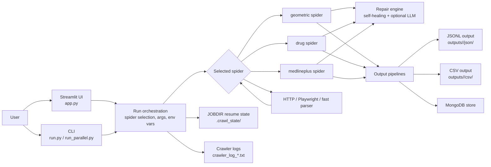

# Geometric Crawler

Geometric Crawler is a Python web-crawling system for structured extraction, with a strong focus on drug and medical content. It combines Scrapy, optional Playwright rendering, fast HTML parsing, self-healing extraction logic, parallel execution, and durable output logging so a crawl can be rerun, resumed, audited, and compared over time.

## Why This Project Exists

The project was built to solve a common extraction problem: many target sites do not expose clean APIs, use inconsistent HTML layouts, and frequently change structure. Instead of writing one-off scripts per site, this crawler keeps the extraction flow generic and adds layered recovery logic so the same engine can handle broad sites, drug detail pages, medical reference content, and listing pages.

The main design goals are:

- reduce manual scraping maintenance
- preserve crawl state across interruptions
- keep outputs structured for downstream analysis
- support both speed and resilience
- provide a UI for non-terminal usage

## What It Does

The repository currently provides three main crawl modes:

- `geometric`: a general-purpose spider for structured extraction across arbitrary sites
- `drug`: a drug-focused spider tuned for medicine directories and product pages
- `medlineplus`: a MedlinePlus-specific spider for medical reference content

Supporting capabilities include:

- self-healing repair strategies for broken field extraction
- optional LLM-assisted repair
- HTTP-only or Playwright-backed crawling
- parallel crawl execution
- persistent job directories for resume support
- JSONL, CSV, and MongoDB output pipelines
- Streamlit-based runtime control

## How It Works

The execution path is intentionally simple:

1. `run.py` or the Streamlit app collects spider settings and target URLs.
2. Command-line options are translated into environment variables and Scrapy arguments.
3. A per-run `JOBDIR` is created under `.crawl_state/` so queued requests can resume after interruption.
4. The selected spider crawls pages, extracts fields, and can fall back through repair logic when selectors fail.
5. Pipelines write the data to MongoDB, JSONL, and CSV with domain-based output organization.
6. Run logs are persisted as `crawler_log_YYYYMMDD_HHMMSS.txt`, including benchmark summary and exit status.

## Architecture



Core modules:

- `run.py`: single-crawl CLI entry point
- `run_parallel.py`: multi-site parallel runner
- `app.py`: Streamlit UI and execution wrapper
- `geometric_crawler/spiders/geometric_spider.py`: general extraction spider
- `geometric_crawler/spiders/drug_spider.py`: drug site spider
- `geometric_crawler/spiders/medlineplus_spider.py`: MedlinePlus spider
- `geometric_crawler/repair.py`: layered extraction repair engine
- `geometric_crawler/pipelines.py`: MongoDB, JSONL, and CSV storage
- `geometric_crawler/settings.py`: Scrapy, Playwright, middleware, and output defaults

Output layout:

- `outputs/<domain>/json/`
- `outputs/<domain>/csv/`
- `.crawl_state/`
- `crawler_log_*.txt`

## Project Benefits

- More resilient than a single fixed-selector scraper.
- Easier to operate because crawl state and logs are saved automatically.
- Better for comparative analysis because output is normalized and domain-scoped.
- Faster on large targets because the crawler supports parallel extraction and a fast parser path.
- Easier to adapt because site-specific logic is isolated inside spiders and repair layers.

## Setup

### Prerequisites

- Python matching the project requirements in `pyproject.toml`
- Windows, macOS, or Linux
- Playwright browser binaries if you use browser rendering
- MongoDB if you want database persistence

### Install

```powershell
python -m venv .venv
.\.venv\Scripts\Activate.ps1
pip install -r requirements.txt
playwright install
```

If you use `.env`, place environment values there before running the crawler.

## Usage Guide

### Single Crawl

```powershell
python run.py --spider geometric --url https://example.com --pages 50 --depth 2
```

### Drug Crawl

```powershell
python run.py --spider drug --url https://www.1mg.com/drugs-all-medicines --pages 100 --depth 3 --max-drugs 200
```

### Resume an Existing Output File

```powershell
python run.py --spider drug --url https://www.1mg.com/drugs-all-medicines --use-existing-file --existing-file outputs/drug/csv/drug_latest.csv
```

### Parallel Crawl

```powershell
python run_parallel.py --preset drugs --cores 4 --pages 50 --depth 2
```

### Streamlit UI

```powershell
streamlit run app.py
```

The UI is useful when you want to:

- start crawls without typing long commands
- switch between spiders quickly
- tune concurrency, delays, and repair settings interactively
- inspect live run output and summary stats

## Important CLI Flags

- `--follow-patterns`: restricts which URLs are followed
- `--http-only`: skips Playwright and uses HTTP only
- `--playwright-always`: forces browser rendering for every page
- `--use-llm`: enables LLM-backed repair if configured
- `--detail-only`: writes only detailed item records
- `--new-file`: forces a new output file for the run
- `--use-existing-file`: appends or resumes into an existing file

## Statistical Validation

The project includes built-in runtime benchmark logging. Each run writes request counts, item counts, elapsed time, and average throughput to the persistent log file. That makes the project measurable instead of just functional.

Observed successful run samples from the saved crawler logs:

| Run log | Requests | Items | Elapsed | Req/s | Items/s |
| --- | ---: | ---: | ---: | ---: | ---: |
| `crawler_log_20260331_163203.txt` | 41 | 7 | 72.2s | 0.57 | 0.10 |
| `crawler_log_20260316_150137.txt` | 8,434 | 4,518 | 5,081.2s | 1.66 | 0.89 |
| `crawler_log_20260317_123148.txt` | 3,406 | 2,015 | 1,571.2s | 2.17 | 1.28 |
| `crawler_log_20260317_114057.txt` | 187 | 17 | 104.9s | 1.78 | 0.16 |
| `crawler_log_20260325_151706.txt` | 106 | 24 | 73.3s | 1.45 | 0.33 |

What this shows:

- the crawler scales from small site samples to multi-thousand-request jobs
- throughput stays in the low single-digit requests per second range, which is typical for cautious crawling with rendering, retries, and protection layers enabled
- item yield varied from roughly 9% to 59% in the sampled successful runs, which is expected because different sites expose different amounts of crawlable content

This is practical validation, not a formal benchmark suite. It confirms that the logging and crawl pipeline are producing measurable output across both small and large jobs.

## Deployment Guide

### Local Deployment

For local use, the crawler only needs:

- the Python environment
- Scrapy and Playwright dependencies
- writable `outputs/` and `.crawl_state/` folders
- optional MongoDB access if database storage is enabled

### Scheduled or Headless Deployment

If you want to run the crawler unattended:

- use Windows Task Scheduler, cron, or another job runner
- execute commands from the project root so relative paths resolve correctly
- keep the virtual environment activated for the scheduled command
- preserve `.crawl_state/` so interrupted jobs can resume
- preserve `outputs/` and `crawler_log_*.txt` for auditing

### Service Considerations

For a shared machine or server deployment:

- keep Playwright browser dependencies installed on the host
- configure MongoDB connection variables only if you need DB persistence
- make sure the output directories are writable by the service account
- avoid overly aggressive concurrency on target sites with rate limits

### Current Deployment Shape

This repository is currently best described as a local-to-semi-managed crawler project rather than a fully containerized service. There is no Dockerfile or cloud deployment template in the repo yet, so deployment is handled through the Python environment, the CLI, and the Streamlit app.

## Output and Data Management

Pipelines write data using a domain-based layout so runs stay organized and comparable.

- JSONL: structured event-style output for downstream processing
- CSV: flat analysis-friendly export
- MongoDB: searchable operational store for larger datasets and lookups

Run identifiers are tied to the spider, site domain, and run number, which makes historical comparison easier.

## Known Strengths

- Good for medical and drug content where headings and sections vary a lot.
- Strong fallback behavior when a selector fails.
- Useful logging for debugging, auditing, and performance tracking.
- Output organization is predictable and analysis-friendly.
- Resume support reduces loss from interrupted runs.

## Current Limitations

- Python version requirements should be checked against the environment before deployment.
- There is no container or cloud deployment definition in the repo yet.
- Benchmarking is log-based rather than automated in CI.
- Crawl quality still depends on the target site structure and rate limiting behavior.

## Improvement Roadmap

Recommended next improvements:

- add a formal benchmark script that compares runs across sites and spider modes
- publish a Dockerfile for portable deployment
- add CI checks for linting, smoke crawl validation, and output schema validation
- generate a small sample dataset with known-good expected fields for regression testing
- document environment variables in a separate configuration reference
- add a deployment example for Windows Task Scheduler and Linux cron
- build a small metrics dashboard from the saved crawl logs

## Troubleshooting

- `scrapy` not found: activate the virtual environment and reinstall dependencies.
- Playwright errors: rerun `playwright install`.
- MongoDB connection issues: verify the service is running and the connection string is correct.
- Unexpectedly low output: reduce filters, adjust follow patterns, or relax HTTP/Playwright settings.
- Resume behavior seems wrong: check `.crawl_state/` and the target URL used for the current run.

## License

No license file is currently included in this repository.
